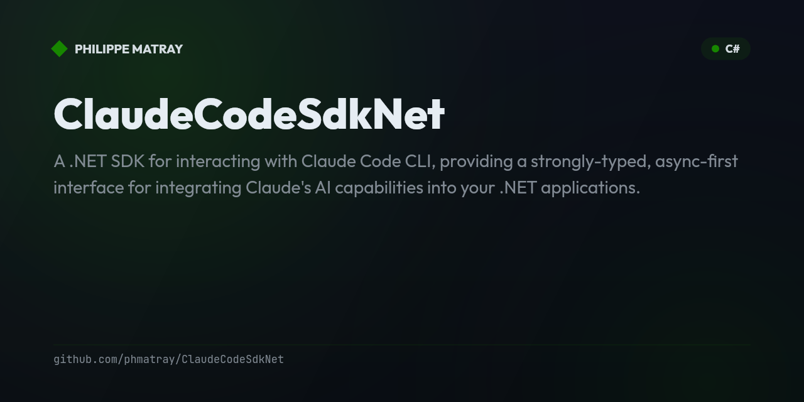

# Claude Code SDK for .NET

<!-- portfolio-badges:start -->
<!-- Identity -->
[](https://github.com/phmatray/ClaudeCodeSdkNet)

[](https://github.com/phmatray/ClaudeCodeSdkNet/stargazers)
[](https://github.com/phmatray/ClaudeCodeSdkNet/network/members)

<!-- Activity -->
[](https://github.com/phmatray/ClaudeCodeSdkNet/issues)
[](https://github.com/phmatray/ClaudeCodeSdkNet/pulls)
[](https://github.com/phmatray/ClaudeCodeSdkNet/commits)
<!-- portfolio-badges:end -->


A .NET SDK for interacting with Claude Code CLI, providing a strongly-typed, async-first interface for integrating Claude's AI capabilities into your .NET applications.

## Features

- **Async/Await Support**: Built on `IAsyncEnumerable` for efficient streaming
- **Strong Typing**: Fully typed messages, options, and responses
- **Cross-Platform**: Works on Windows, macOS, and Linux
- **Comprehensive Error Handling**: Detailed exceptions for different failure scenarios
- **Flexible Configuration**: Support for all Claude Code CLI options
- **MCP Server Support**: Integrate with Model Context Protocol servers

## Installation

```bash
dotnet add package ClaudeCodeSdkNet
```

## Prerequisites

- Claude Code CLI must be installed. [Download here](https://claude.ai/download)
- .NET 9.0 or later

## Quick Start

```csharp
using ClaudeCodeSdkNet;

// Simple query
await foreach (var message in ClaudeCode.QueryAsync("Write a hello world program in C#"))
{
    if (message is AssistantMessage assistant)
    {
        foreach (var block in assistant.Content)
        {
            if (block is TextBlock text)
            {
                Console.WriteLine(text.Text);
            }
        }
    }
}
```

## Configuration Options

```csharp
var options = new ClaudeCodeOptions
{
    Model = "claude-3-5-sonnet-20241022",
    MaxTurns = 5,
    Cwd = "/path/to/project",
    AllowedTools = new List<string> { "read_file", "write_file" },
    DisallowedTools = new List<string> { "bash" },
    SystemPrompts = new List<string> { "You are a helpful assistant" },
    PermissionMode = PermissionMode.AcceptEdits,
    PromptCaching = true
};

await foreach (var message in ClaudeCode.QueryAsync("Help me with my code", options))
{
    // Process messages
}
```

## Message Types

The SDK supports all Claude Code message types:

- `UserMessage`: User input messages
- `AssistantMessage`: Claude's responses with content blocks
- `SystemMessage`: System messages with metadata
- `ResultMessage`: Final results with usage statistics

## Content Blocks

Assistant messages contain content blocks:

- `TextBlock`: Plain text responses
- `ToolUseBlock`: Tool invocations
- `ToolResultBlock`: Tool execution results

## Error Handling

```csharp
try
{
    await foreach (var message in ClaudeCode.QueryAsync("Help"))
    {
        // Process messages
    }
}
catch (CLINotFoundException)
{
    // Claude CLI not installed
}
catch (ProcessException ex)
{
    // CLI process failed
    Console.WriteLine($"Exit code: {ex.ExitCode}");
    Console.WriteLine($"Error: {ex.StdError}");
}
catch (CLIJSONDecodeException ex)
{
    // Failed to parse JSON response
    Console.WriteLine($"Raw data: {ex.RawData}");
}
```

## Advanced Usage

### Get All Messages

```csharp
var messages = await ClaudeCode.QueryAllAsync("Explain async/await");
foreach (var message in messages)
{
    Console.WriteLine($"Type: {message.Type}");
}
```

### Get Only Result

```csharp
var result = await ClaudeCode.QueryResultAsync("What is 2 + 2?");
if (result != null)
{
    Console.WriteLine($"Answer: {result.Result}");
    Console.WriteLine($"Tokens: {result.Usage?.TotalTokens}");
    Console.WriteLine($"Cost: ${result.Cost:F4}");
}
```

### With Cancellation

```csharp
using var cts = new CancellationTokenSource(TimeSpan.FromMinutes(5));

await foreach (var message in ClaudeCode.QueryAsync("Write a long essay", cancellationToken: cts.Token))
{
    // Process messages
}
```

### MCP Server Integration

```csharp
var options = new ClaudeCodeOptions
{
    McpServers = new List<McpServerConfig>
    {
        new McpStdioServerConfig
        {
            Name = "filesystem",
            Command = "npx",
            Args = new List<string> { "-y", "@modelcontextprotocol/server-filesystem", "/tmp" }
        }
    }
};
```

## API Reference

### ClaudeCode.QueryAsync

```csharp
IAsyncEnumerable<Message> QueryAsync(
    string prompt,
    ClaudeCodeOptions? options = null,
    string? claudePath = null,
    ILogger? logger = null,
    CancellationToken cancellationToken = default)
```

Streams messages as they arrive from Claude Code CLI.

### ClaudeCode.QueryAllAsync

```csharp
Task<List<Message>> QueryAllAsync(
    string prompt,
    ClaudeCodeOptions? options = null,
    string? claudePath = null,
    ILogger? logger = null,
    CancellationToken cancellationToken = default)
```

Collects all messages into a list.

### ClaudeCode.QueryResultAsync

```csharp
Task<ResultMessage?> QueryResultAsync(
    string prompt,
    ClaudeCodeOptions? options = null,
    string? claudePath = null,
    ILogger? logger = null,
    CancellationToken cancellationToken = default)
```

Returns only the final result message.

<!-- portfolio-techstack:start -->

## Tech Stack

- **.NET 9 · .NET 8**
- System.Text.Json
- Microsoft.Extensions.Logging.Abstractions
- Spectre.Console
- Spectre.Console.Cli
- Nuke.Common

<!-- portfolio-techstack:end -->

## License

MIT

## Contributing

Contributions are welcome! Please feel free to submit a Pull Request.